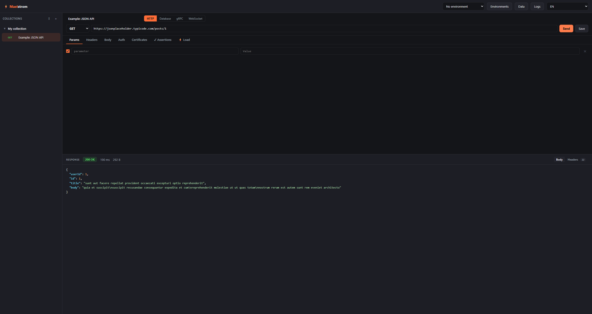
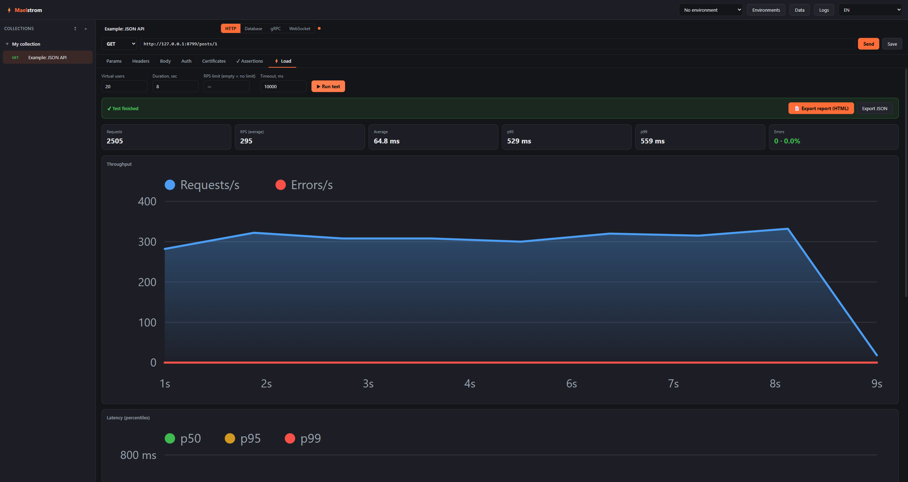

# ⚡ Maelstrom

**A desktop API client with built-in load testing.** HTTP, gRPC, WebSocket and
databases — compose a request, assert the response, then run it under load and get
an HTML report. Ships with a headless CLI for CI/Kubernetes.

> Pull your API into the maelstrom.


## Download

Grab the file for your OS from the **[Releases](../../releases)** tab:

| OS | File |
|----|------|
| Windows | `Maelstrom_x64.msi` (installer) or `Maelstrom.exe` (portable, no install) |
| macOS | `Maelstrom_universal.dmg` |

**Windows:** on first launch SmartScreen may warn (the app isn't code-signed yet) —
click **More info** → **Run anyway**.
**macOS:** the app isn't notarized — right-click it → **Open** (once), then launch normally.

## Screenshots

**HTTP client** — compose a request, send it, inspect the response:



**Load testing** — virtual users, live charts, latency percentiles and an HTML report:



## Features

- HTTP client: collections, `{{var}}` environments, auth (Bearer/Basic/OAuth2/SSO), mTLS.
- Load testing: virtual users, RPS cap, live charts, HTML report, automatic token refresh.
- **gRPC** from a `.proto` (unary + every streaming mode) and **WebSocket** — call and load.
- **Response assertions** (status/latency/format/JSON field) — built for dynamic data.
- Request data from CSV/JSON/S3/**databases**, plus file pools for uploads.
- OpenAPI/Swagger import, multi-endpoint "service load".
- **CLI** for pipelines: thresholds → exit codes, Docker image, k8s manifests.

## CLI (headless — for CI / Kubernetes)

The same load engine ships as a small CLI. Grab a binary from [Releases](../../releases) — `maelstrom-windows-x64.exe`, `maelstrom-macos`, or `maelstrom-linux-x64` — or pull the container:

```bash
docker pull ghcr.io/slakertop1/maelstrom-cli:latest
docker run --rm -v "$PWD:/work" ghcr.io/slakertop1/maelstrom-cli:latest \
  /work/scenario.json --out-json /work/report.json --max-error-rate 1 --max-p95 400
```

Export a scenario from the app, point the CLI at it, and inject secrets via environment variables (referenced as `${VAR}` in the config). It writes JSON + HTML reports and **exits non-zero when a threshold is breached**, so your pipeline gates on it. Ready-made **GitHub Actions**, GitLab CI, and Kubernetes Job/CronJob examples are in [`deploy/`](deploy/).

## Feedback

- 🐞 **Bug?** In the app: **Logs** → **Report a bug** (bundles version, OS and the log) —
  or just [open an issue](../../issues/new).
- 💡 **Idea?** [Discussions](../../discussions) or an [enhancement issue](../../issues/new).

Thanks for testing! The project is in active beta.
